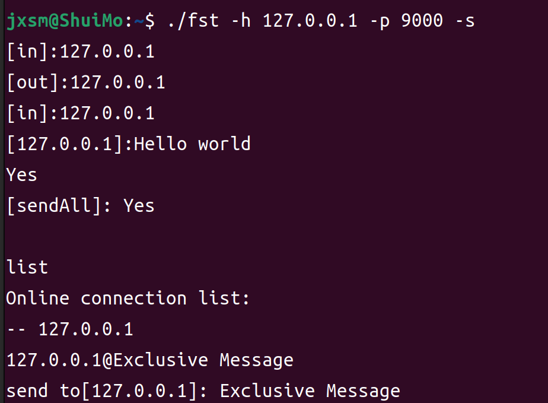

# FastSocketsTool

---

<div align="center">
    
    
    
</div>

<p align="center">
  English|
<a href="doc/markdown/chinese.md">简体中文</a>
</p>

<p align="center">
    <a href="doc/markdown/Acknowledgments.md">Acknowledgments</a>
</p>

---
## Introducing
FastSocketsTool is a Socket utility based on the Golang, offering a range of 
common Socket functionalities, including the transmission and reception of 
data, with the added capability to specify encoding methods for both sending and receiving operations.


## Compile

```shell
git clone https://github.com/jxsm/FastSocketsTool.git

// Enter the project directory.
cd FastSocketsTool

// Install dependencies.
go mod tidy

// compile
go build cmd/fst.go
```

## Client
```shell
./fst -h 127.0.0.1 -p 9000
```


## Server
```shell
./fst -h 127.0.0.1 -p 9000 -s
```


When operating in server mode, you can input `list` to view all currently connected clients, and use `exit` to terminate the server mode.

By default, in server mode, the data you send is broadcasted to all connected clients, meaning each connected party will receive your transmitted data. However, you have the option to direct your message to a specific client by using the format `ip@content` when inputting your message. For instance:
```
127.0.0.1@hello
```

## Parameters
>Server mode currently supports TCP only.

| Parameter | Instructions                                 | Default value |
|-----------|----------------------------------------------|---------------|
| -h        | Specify the IP address of the server         |               |
| -p        | Specify the port number of the server        |               |
| -e        | Specify the encoding method for transmission | UTF-8         |
| -re       | Specify the encoding method for reception.   | UTF-8         |
| -u        | UDP mode                                     | false         |
| -s        | Server mode                                  | false         |
| -6        | ipv6                                         | false         |