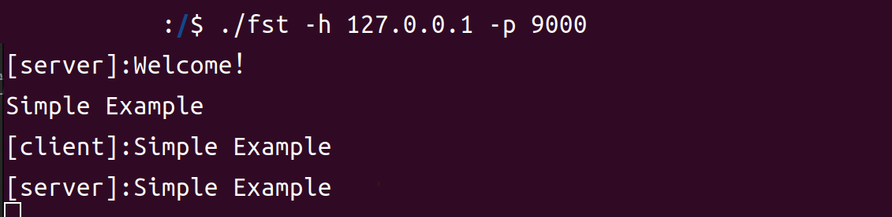

# FastSocketsTool

---
<div class="revealIcon">
    
    
    

<style>
    .revealIcon{
        display: flex;
        justify-content: center;
        margin-bottom: 10px;
    }
    .revealIcon img:not(:first-child) {
        margin-left: 10px;
    }

</style>
</div>

<p style="text-align: center">
  简体中文|
<a href="../../README.md">English</a>
</p>

---
## 介绍

FastSocketsTool 是一个基于Go语言的Socket工具，它提供了一些常用的Socket功能，
例如发送和接收数据,并且可以指定其发送和接收时使用的编码方式

## 编译

```shell
git clone https://github.com/jxsm/FastSocketsTool.git

// 进入项目目录
cd FastSocketsTool

// 安装依赖
go mod tidy

// 编译
go build cmd/fst.go
```

## 使用
```shell
./fst -h 127.0.0.1 -p 9000
```


## 参数
> 服务器模式正在制作中, 目前仅支持客户端模式

| 参数  | 说明         | 默认值   |
|-----|------------|-------|
| -h  | 指定服务器的IP地址 |       |
| -p  | 指定服务器的端口号  |       |
| -e  | 指定发送编码方式   | UTF-8 |
| -re | 指定接收编码方式   | UTF-8 |
| -u  | udp模式      | false |
| -s  | 服务器模式      | false |
